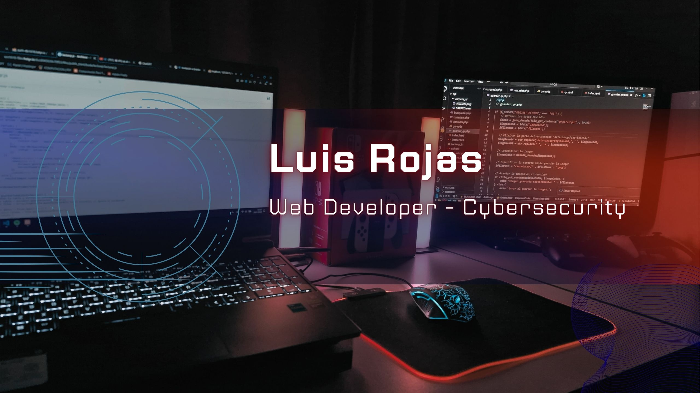

## Hi there 👋 I'm Luis Armando Rojas

💻 Full-Stack Developer | 🧠 Problem Solver | 📍 Based in San Luis Potosí

I build elegant solutions for complex challenges — from responsive web apps to automation scripts and facial recognition systems.

### 🔧 Tech I work with:
- Frontend: HTML, CSS, JavaScript
- Backend: PHP, Python, MySQL
- Tools & More: Git, Linux, C++, Kali Linux

### 🚀 Projects I’m proud of:
- 🎉 Custom event invitations with QR access and RSVP management
- 🧠 Facial recognition login systems
- 🌐 Company websites with custom domains and mail servers

### 📫 Let’s connect!
- [Portfolio](#) | [Email](mailto:luisrojas.mtz271@gmail.com)

> *"If you can imagine it, you can code it."*

